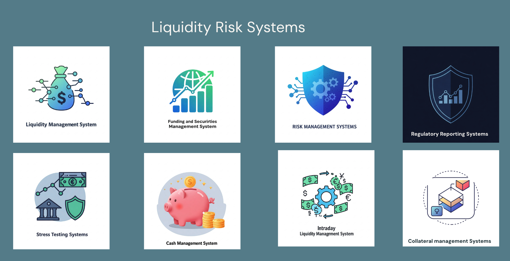
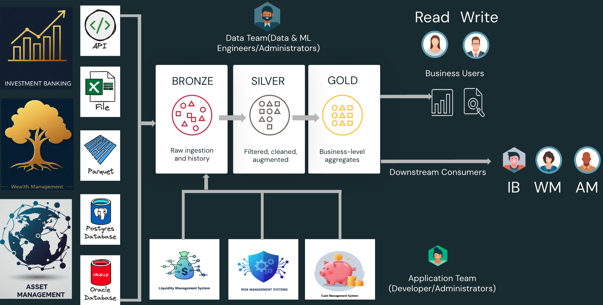

# Unity Catalog Deployment Patterns for Banking in the Risk Domain
This repository provides a solution accelerator for designing deployment patterns in Unity Catalog specifically for the risk domain in banking, with a focus on the liquidity risk team.

## Overview
🏛️ Unity Catalog is a unified governance solution for all data and AI assets in your Databricks Lakehouse. This repository showcases how banks, particularly in the risk domain, can deploy Unity Catalog to manage and share data effectively.

## 🎯 The Nine Risk Categories as per OCC

1. 💳 **Credit Risk**: Risk of obligor's failure to meet contract terms.
2. 📈 **Interest Rate Risk**: Risk from interest rate movement. 
3. 💰 **Liquidity Risk**: Risk of bank's inability to meet obligations.
4. 📊 **Price Risk**: Risk from changes in financial instrument value.
5. 🌐 **Foreign Exchange Risk**: Risk from exchange rate changes.
6. 🔄 **Transaction Risk**: Risk from problems with product delivery.
7. ⚖️ **Compliance Risk**: Risk from violations of laws and regulations.
8. 🎯 **Strategic Risk**: Risk to earnings or capital from poor business decisions or implementation.
9. 👥 **Reputation Risk**: Risk to earnings or capital from negative public opinion.

## Focus on Liquidity Risk in Banking

Liquidity risk is the risk that a bank will not be able to meet its financial obligations as they come due.
This can happen if a bank does not have enough cash on hand to meet withdrawals or other obligations.
Banks must manage liquidity risk carefully to avoid a liquidity crisis.
A liquidity crisis can lead to a bank run, which can cause the bank to fail.

### Liquidity Risk Systems

For the sake of this usecase we will consider the below systems as part of the liquidity risk domain.

  
  
  *Core Systems Supporting Liquidity Risk Management*
  
  ---
  
  🏦 **Key Systems** 🏦

The liquidity risk team ingests data from multiple sources and formats:

🔄 **Source Systems**:
- Internal Liquidity Risk Systems (e.g., Cash Flow Projections, Stress Testing)
- Business Units:
  - Wealth Management (Parquet files, PostgreSQL)
  - Investment Banking (Oracle DB, REST APIs)
  - Asset Management (CSV files, SQL Server)
  - Treasury (Real-time market data feeds)

📊 **Data Processing**:
- Raw data is ingested into Bronze tables
- Standardized and validated in Silver tables
- Business logic applied in Gold tables following the medallion architecture
- Data quality checks and reconciliation at each layer

🔐 **Data Access**:
- Processed data is shared back with business units
- Dynamic row-level filtering ensures each unit only sees their relevant data
- Example: Wealth Management only accesses their client positions
- Access controlled via Unity Catalog permissions

The complete data flow architecture for liquidity risk is illustrated below:

## Catalogs and Schemas

The liquidity risk team defines catalogs and schemas to organize and share data efficiently. This setup ensures that data is accessible and governed according to organizational policies.

## Scripts and Notebooks
This repository includes several scripts and notebooks to facilitate the setup of Unity Catalog:

### Metastore Creation
**create_metastore.py**
- Creates Unity Catalog metastores for different regions, allowing for multi-region data governance.
- **Usage**: 
  - Import the script as a notebook in Databricks
  - Update the `regions` list with your desired regions (e.g., `uk-south`, `france-central`)
  - Run the script to create metastores in each specified region
  - The script will generate unique names for each metastore based on the region
  - Note: This is a prerequisite for creating catalogs and other Unity Catalog objects

### Catalog Creation
**create_catalogs.py**
- Automates the creation of catalogs for each risk domain environment (e.g., credit_risk_dev, liquidity_risk_test)
- **Usage**: Import the script as a notebook in Databricks and run it to create the necessary catalogs

### Storage Credential Registration  
**register_storage_credential.py**
- Registers storage credentials using Azure Managed Identity, with samples for each environment within the risk domains
- **Usage**: Import the script as a notebook, update the managed_identity_id with your actual ID, and execute to register credentials

### External Location Registration
**register_external_location.py** 
- Registers external storage locations linked to the storage credentials, with samples for each environment
- **Usage**: Import the script as a notebook, replace placeholder storage URLs with actual paths, and run to set up locations

## Getting Started

### Prerequisites
- A Databricks account with Unity Catalog enabled
- Appropriate permissions to create and manage Unity Catalog resources
- Access to Azure resources (managed identities, storage accounts)

### Initial Setup
1. Clone this repository to your local environment
2. Import the provided notebooks into your Databricks workspace
3. Follow the step-by-step guides to set up:
   - Catalogs for each risk domain
   - Storage credentials using managed identities
   - External locations for data storage

### Customization
Before running the scripts, you'll need to:
- Update managed identity IDs to match your Azure environment
- Modify storage paths to point to your organization's storage accounts
- Adjust catalog and credential naming conventions if needed
- Configure access control settings based on your security requirements

### Setup Order
1. Create metastores using `create_metastore.py`
2. Register storage credentials using `register_storage_credential.py`
3. Register external locations using `register_external_location.py`
4. Create catalogs using `create_catalogs.py`

